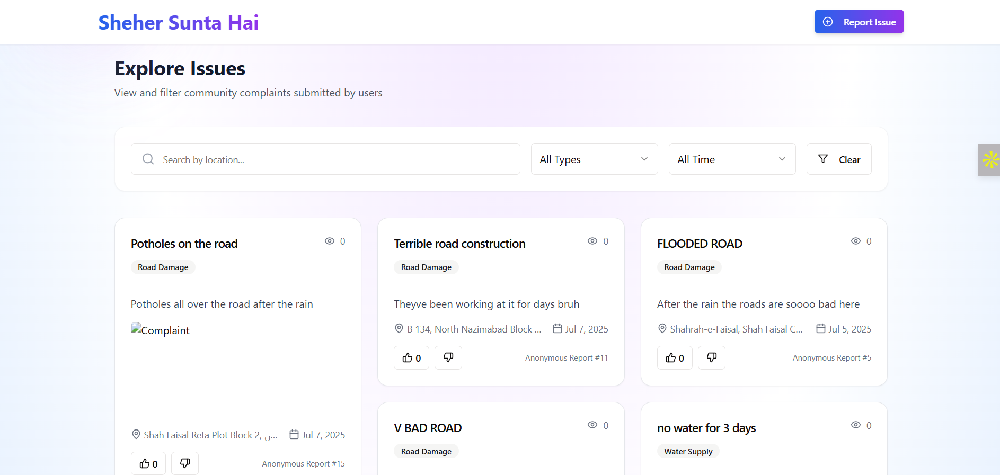
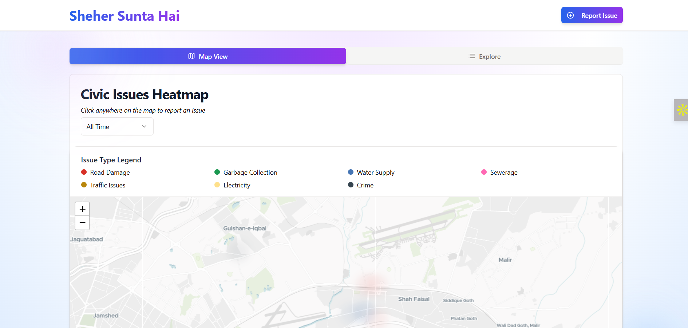
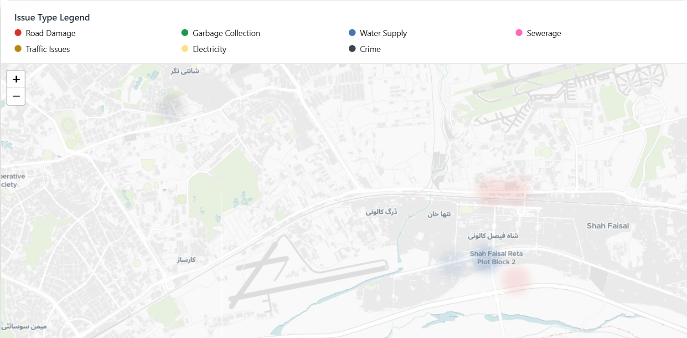

  
# Sheher Sunta Hai: A Civic Issue Dashboard for Pakistani Cities

  

**Sheher Sunta Hai** is a public dashboard where people in Pakistan can **report** civic issues and **see them visualized** on a map. Whether it's garbage dumps, broken roads, or water leaks — this tool gives you a way to **say something**, and have your city *listen*.

> 🛠️ Built with: React + TypeScript + Tailwind + Neon DB + Replit + Cursor

---

## ❤️ Why I Made This

Because so many of us feel helpless when we see problems around us.  
And because I wanted to build something that felt **hyper-local**. Something that says:

> “This is *my* street. This is *my* city. And it matters.”

---

## 📌 What It Does

A free, open-source platform where anyone can:
- Report civic issues (potholes, garbage, water, etc.)
- See a heatmap of complaints in their city
- Explore, upvote, and track issues
- Help make cities better, one tap at a time!

---

## 🗺️ Key Features

- Interactive map with heatmap & pin clustering  
- Time filter (all-time, past week, past month)  
- Beautiful location autocomplete when reporting issues  
- Explore tab with a clean scrollable feed  
- Smooth animations, soft gradients, and startup-vibes UI

---

## Tech Stack
- **Frontend**: React + Vite + TypeScript + TailwindCSS
- **Backend**: Node.js + Express + TypeScript
- **Database**: PostgreSQL (via Drizzle ORM)
- **Map & Geocoding**: [MapTiler](https://www.maptiler.com/) (English tiles), [OpenStreetMap Nominatim](https://nominatim.openstreetmap.org/)
- **Heatmap**: Leaflet + leaflet.heat
- **File Uploads**: Multer (local `/uploads` folder)
- **State & Data**: React Query

## APIs & Integrations
- **Map Tiles**: MapTiler OSM English (free tier)
- **Location Suggestions**: OpenStreetMap Nominatim

---

## 🐛 Bugs I Survived

- Complaint form covering everything like a villain  
- Tabs disappearing into the void when the map was clicked  
- Cursor mysteriously working on half a button  
- Autocomplete refusing to autocomplete anything  
- And yes, one entire meltdown over floating orbs

---

## 🪄 Screenshots

  

  

  

---

## 💖 Live Demo

🌐 Try it here:  
https://sheher-sunta-hai.onrender.com/

---

## 🚧 Known Limitations / TODOs

- No admin dashboard yet  
- No real-time moderation  
- Heatmap radius tuning for better clustering  
- More precise location suggestions & tagging  

---

## 🙏 A Note of Gratitude

To the people who report problems instead of walking past them.  
And to me, for debugging for 6 hours straight with no water bottle in sight.

---

## 🧵 Dev Story

Full post on LinkedIn: [link-coming-soon]  
TL;DR: I wanted to make something that feels like a small but powerful tool for change. And then I did. 💫

---

## ⭐ GitHub Things

If this feels like something your city should have:

- 🌟 Star the repo  
- 🍴 Fork and expand  
- 🐞 File bugs if you find any  
- 🗺️ Share with your local community

---

## 🇵🇰  Built for Pakistan

This isn’t just a project.  
It’s a little love letter to our cities — and a reminder that *they’re ours to fix.*

